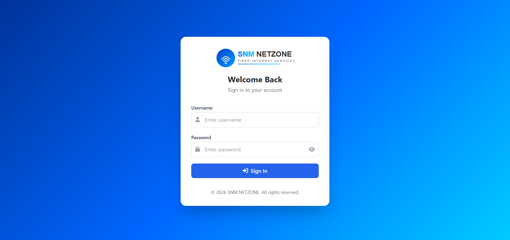
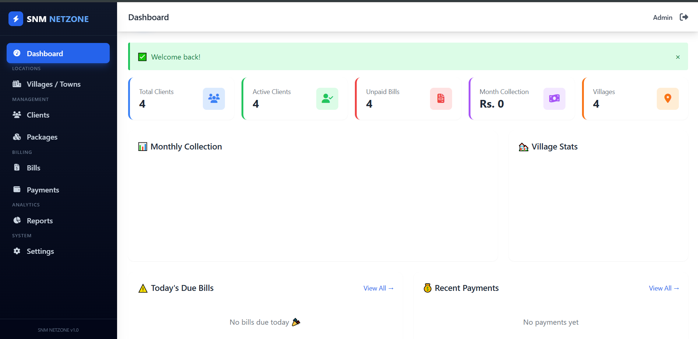
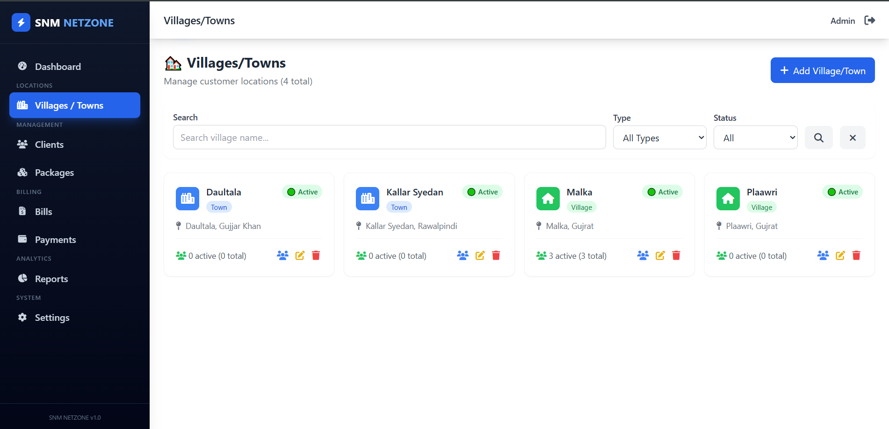
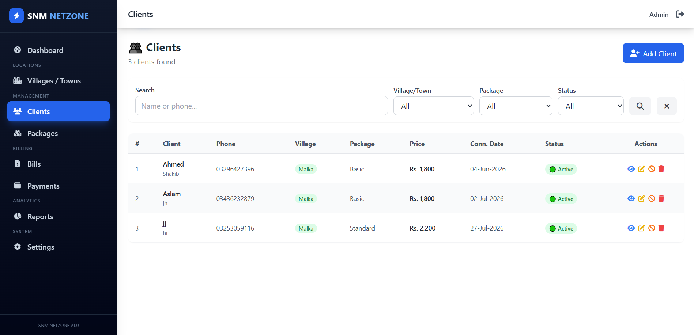
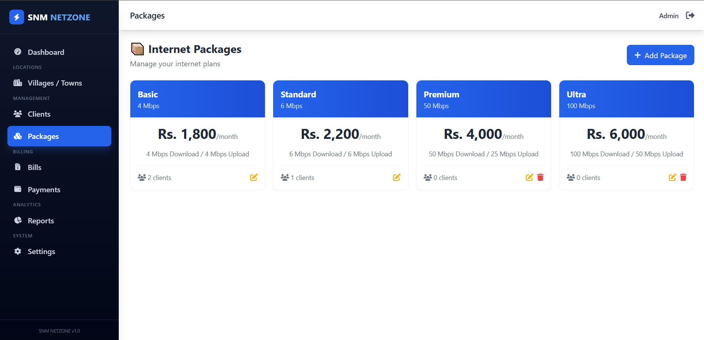
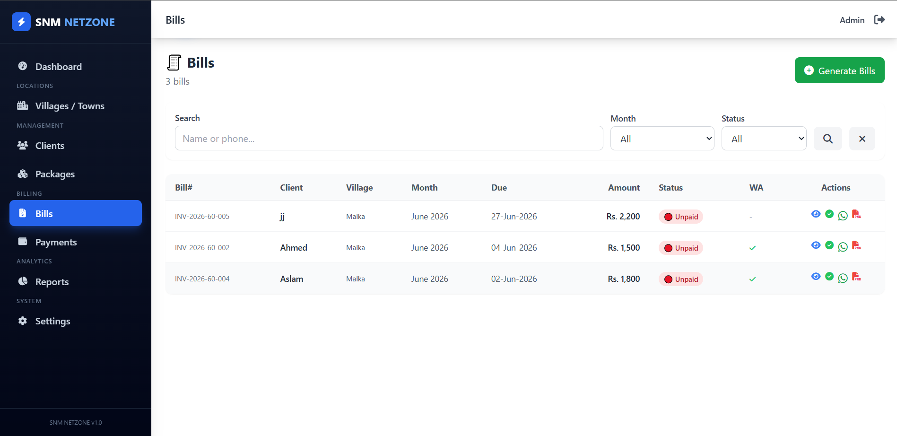
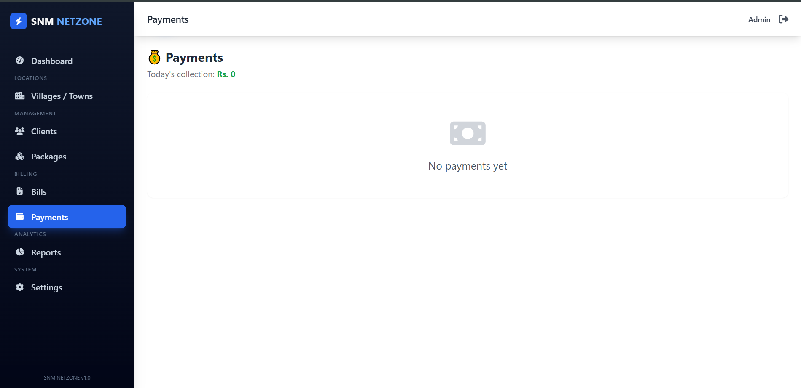
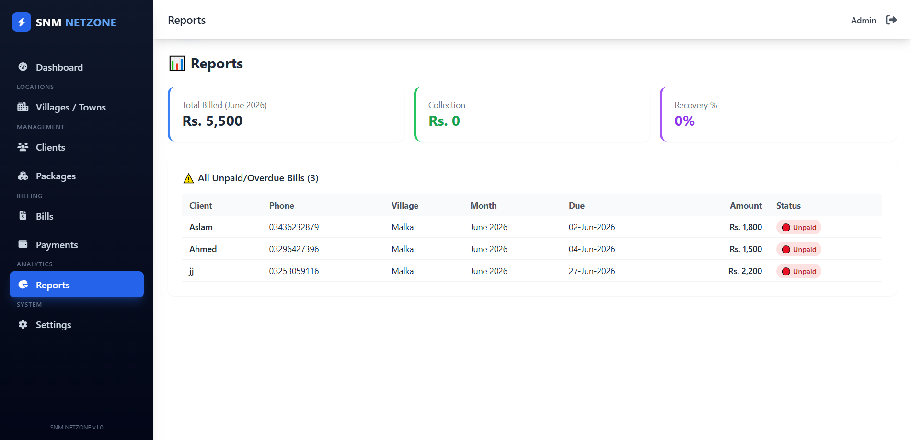
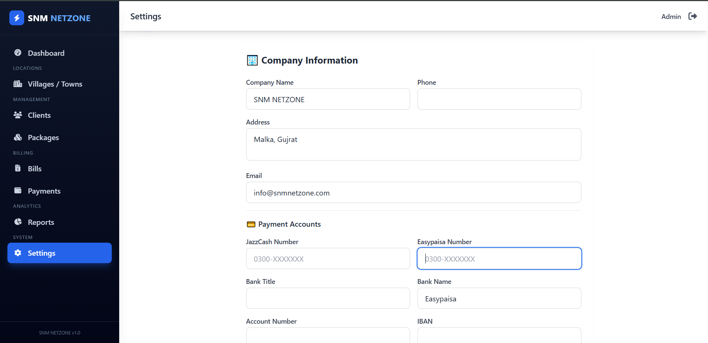

# 🚀 SNM NetZone - ISP Billing Management System

  
  
  
  

  <b>SNM NetZone</b> is a robust and scalable ISP Billing Management System designed to bridge the gap between service providers and their clients. It automates critical administrative tasks such as bill generation, payment tracking, and client lifecycle management.

---

## 📋 Project Overview
Managing an ISP business requires precision in billing and client data. **SNM NetZone** provides a centralized, secure, and user-friendly interface for admins to oversee the entire operation without technical complexity. Whether it's managing internet packages, tracking payments, or communicating with clients via WhatsApp, this system acts as a "one-stop shop" for ISP administrators.

---

## 🎥 Project Demo
Witness the system's efficiency in action.
> **[Watch the full walkthrough on YouTube](PASTE_YOUR_YOUTUBE_LINK_HERE)**

---

## ✨ Key Features
The system is packed with professional modules to ensure smooth business operations:

*   **Secure Admin Login:** Multi-layered authentication to protect sensitive company data.
*   **Modern Dashboard:** A visually appealing overview of system analytics, active users, and pending payments.
*   **Geography Management:** Organized structure for Village/Town wise client categorization.
*   **Client Management:** Comprehensive CRUD operations for client profiles and internet service assignments.
*   **Automated Billing Engine:** Effortless bill generation for thousands of clients in a few clicks.
*   **Payment & Transaction Logs:** Accurate recording of all payments, helping in revenue reconciliation.
*   **Reporting & Analytics:** Generate meaningful reports to analyze business growth and identify trends.
*   **PDF Invoicing:** Professional-grade invoice generation tailored for business standards.
*   **WhatsApp Integration:** Instant communication tools to notify clients about bills and payment reminders.
*   **Responsive Architecture:** Fully fluid design using Bootstrap 5, ensuring compatibility across desktop, tablet, and mobile devices.

---

## 🛠 Tech Stack
*   **Backend:** Core PHP (Engineered for performance and security)
*   **Database:** MySQL (Structured for complex queries and data integrity)
*   **Frontend:** Bootstrap 5, HTML5, CSS3, JavaScript
*   **Tools:** Canva (for professional UI/UX mockups)

---

# 📸 System Visuals

Admin Panel    

  
 
Dashboard
 

Village / Town

Clients 

 

 Packages
 
 

Bills

 

Payments
  
Reports
 
Settings
 

---

## 👨‍💻 Developer
**Shayan Azhar**  
*Mobile, Web App, and Website Developer*

I am a passionate developer with a deep focus on building scalable web solutions that solve real-world problems. With expertise in Flutter and PHP-based web systems, I strive to deliver clean, efficient, and user-centric applications.

[🔗 GitHub Profile](https://github.com/shayan314) | [📧 Contact for Projects](mailto:chshayan314@gmail.com)

---

  <i>Built with ❤️ by Shayan Azhar | © 2026 SNM NetZone</i>

